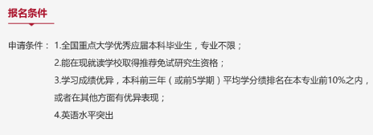

# [CN]-16-赵言楚 保研 金融 @ 清华大学

谢谢飞跃手册邀请我来分享一下自己的申请的心路历程，希望看到的学弟学妹们能够有所收获，少走点弯路，能你们都可以顺利达成自己的目标。我的申请历程可能和其他人不太一样，我是保研+出国两手准备。在我看来，这样的准备方式相对稳妥，但是需要付出更多的努力。这篇文章旨在讲述一个曾经的出国党的保研历程，同时介绍我参加的夏令营，希望能给学弟学妹们提供一些帮助。（本文不含任何录取经验分享，只分享大学经历和清华项目介绍）

### 基本情况

> 绩点： 3.86 (1/63) 
>
> 获奖情况：国家奖学金、优秀学生一等奖学金两次、广东省优秀团员、普华永道职场新锐挑战赛 季军、HSBC汇丰全球案例分析大赛华南赛区 第三名、全国大学生英语竞赛C类 特等奖、优秀学生记者、优秀义工二等奖、优秀大学长等等
>
> 交流经历：牛津大学暑期交流，伯克利BGA学期交流项目
>

### 申请结果
> 夏令营录取：清华大学经管学院金融硕士

### 保研+出国怎么准备？

很多优秀的同学在一开始就能坚定自己的想法，选择保研或者出国。而我作为选择困难症患者，一直都不太确定应该怎么选择。所以我就选择了两个同时准备的方式，慢慢思考。两者区别比较大，但有很多相通的地方可以准备。

1. GPA 这个不用多说，一个好看的gpa无论是出国还是保研都是必须的。很多学弟学妹会私底下问我怎么能在某某课上拿高分，其实我真的也没有什么学习秘籍诀窍什么的。不翘课，认真听课，认真完成作业，争取每一个可以加分的机会。这些事情说起来简单，做起来难。如果都能做到，我相信大家是可以拿高分的。

2. 英语 申请出国托福雅思G是必须的，在保研中也有锦上添花的作用（清华经管的夏令营GRE/GMAT成绩可以免笔试，具体成绩可以在官网上查询）。关于英语学习的经验分享我在致仁书院公众号上有分享，搜索英语就可以了。

3. 实习 建议从大二开始就准备找实习，多Networking一下。和自己准备申请的方向有关最佳。南科大有金融校友会成立的实习分享群，群号644207171。可以多关注一下学长学姐的内推机会。四大/证券/银行的各大招聘公众号，一些专门做实习分享的公众号。个人认为有2-3份实习最佳。注意不要因为实习过多而耽误学业，学业还是最重要的。

4. 比赛 有时间的话参加金融有关的比赛。即使没有拿到名次，从长远来看，也是对自己有益的。在比赛中，你会遇到太多自己没有接触到过的知识，在完成比赛的过程中你会成长的很快。我参加过的比赛有：CFA Research Challenge、汇丰商业案例大赛、欧莱雅Brainstorm商业策划大赛、PWC星锐职场挑战赛、全国金融与证券投资模拟实训大赛等。在比赛的过程中你还会认识很多优秀的朋友，一起为同一个目标奋斗的时光真的特别棒。非金融类比赛的获奖也许帮助不会太大，但是有国际，国家级大赛的经历，老师也许会更感兴趣，提一些相关的问题。

5. 社团活动 虽然平时学习任务繁重，我还是强烈建议大家参社团和学生组织。在组织活动中可以锻炼自己的能力，再者在社团中认识熟悉点小伙伴们可能会变成你最好的朋友，在写简历的时候也能在leadership experience里面锦上添花。

保研（夏令营）和出国的申请季是错开的，夏令营集中在3至7月，而出国第一批申请在10月左右。如果你没有在夏令营获得心仪的offer，就可以选择申请出国。在参加夏令营的时候我就不算太紧张，因为如果遗憾没有通过，我还是有PlanB继续申请。我的规划就是沿着这样的思路，只挑了自己喜欢的项目报名：base 深圳，有双学位项目。这样就不至于整个大三下太紧绷，事情太多，让自己压力过大（其实压力也挺大的）。

### 交流项目如何申请？对申请/保研的帮助有多大？

* 短期交流：牛津项目是和南科大合作的，通过国际合作部申请。含金量一般，费用却高，大概也是因为牛津这两个字让它身价暴涨。虽说如此，在我申请pwc实习的时候，manager对我的这段经历却很感兴趣，最后也顺利拿到offer。我觉得短期交流主要是出去开眼界，然后感受一下知名学府的学习氛围，这样就差不多啦，一个月时间能做的事情也有限。（反正我科有这么好的补助政策，为什么不去个地方游学一下呢）。

* 长期交流：含金量是比短期交流大很多。一方面这段经历一方面能反应出你能适应国外生活；另一方面如果最后成绩优异，在申请的时候也是个亮点，证明你在国外学校学习的能力也是被认可的。伯克利的BGA Berkeley Global Access Program和哥大的学期交流项目我都是自己DIY申请的，并且都拿到了offer。我感觉准备的材料区别不大。以伯克利的项目为例:

需要申请准备的材料：托福/雅思成绩，成绩单，Statement of Purpose，财产证明，护照复印页（哥大的托福成绩要求是100，成绩单也必须通过WES寄送，申请相对麻烦一些。）

准备好PS之后可以约语言中心的老师改PS，老师们真的是非常nice！

如何选择：在决定去伯克利还是哥大的时候纠结了超级超级久，也咨询了很多老师和同学（在此表达感谢！）我认为可以考虑这几个方面：

1.是否有打算要某个学校老师的推荐信

2.哥大的费用比伯克利贵很多 你觉得是否值得 家里人是否支持

3.是否特别喜欢某个城市 

4.是否需要转换学分

伯克利项目链接
https://extension.berkeley.edu/international/programs/bga-discover/

哥大项目链接 
https://columbianyc.force.com/nd/TX_SiteLogin?startURL=%2Fnd%2FTargetX_Portal__PB

最后我想说的是，出国交流对申请或者保研没有决定性的作用，更多的是锦上添花，让你在和你有同样水平的竞争者中有更多的亮点。抛开功利性不谈，出国交流真的是能让你开拓眼界的好机会。你能感受到国外知名学府的教育氛围，体验不同的文化，交到各国的朋友，真的是非常值得的一件事。并且南科大还给我们提供了这么多合作项目，让我们能接触到也许其他高校没有的资源；给我们提供了奖学金，让每个人都有机会留学。希望大家不要浪费这样的机会。 

### 英语学习有什么心得或者建议嘛？

1.不要想着有捷径

不要想着偷懒，脚踏实地地去做！托福/GRE我认为都是要持续输入才能够获得理想输出的“看谁更认真”考试。踏实地、认真地、背单词，刷TPO，背作文。

2.学会总结错误

听力的话不能错了看看答案就过了，纠错的过程才是更有价值的过程。比如说你可以做精听：把没有听到的句子。听一句，在纠错本上写一句。小站托福等软件都可以定位你错位的题目，然后只播放这一段听力。在前期，你也许会觉得很浪费时间，会花两倍的时候去纠错。可是当你做了几次之后，你就会发现，你错误的题目会越来越少，抓考点也会更加得心应手。

3.抓紧碎片化的时间学习

排队吃饭，在校巴上（坐稳的情况下），课间，都可以拿出app多背几遍单词。我用的app是墨墨app（不是广告），它会自动把之前你选择了不认识的单词以遗忘曲线计算的频率再推给你，让你反复记忆。

### 为什么申请了这个项目？

当初看到清华经管的这个项目只是想试一下的，没有报很大的希望。最后申请通过是意外的惊喜。这个项目最吸引我的一点是：双学位项目。可以在研二的时候自主申请到伯克利，哥大，法国高商HEC，伦敦商学院LBS 读一年，拿清华和以上学校其中一所的双学位。再者我以后想在深圳发展，清华经管在深圳办学，也很符合我的心意。于是下决定申请这一个项目。

**项目简介：**

清华大学经济管理学院金融硕士项目的目标是秉持教育的前瞻性培养金融行业顶尖人才。金融硕士项目致力于培养具有扎实的经济与金融学理论基础和前沿知识，拥有国际视野并能适应金融市场的迅速变化的应用型金融专业人才。他们具备良好的职业道德和杰出的从事金融实际工作的能力，富有创新和进取精神，能够适应金融保险机构、咨询机构、企业及政府相关监管部门工作。

金融硕士项目为全日制学习，学习基本年限为2-3年。此外，金融硕士项目分别与法国巴黎高等商学院（HECParis）、伦敦商学院（London Business School）美国加州伯克利大学哈斯商学院（Hass Schoolof Business, University of California, Berkeley）和美国哥伦比亚大学（Columbia University）双学位教育，金融硕士在读学生将有机会经过竞争申请进入合作学校攻读双学位。

### 这个项目需要准备什么资料？

（以下取自在清华经管的研究生招生官网）

1.报名表;

2.中英文个人简历； 

3.个人陈述:不超过 1500 字; 内容包括但不限于：专业背景、从事过的研究工作、人生经历以及未来的学习和职业计划等；

4.推荐信

5.本科前 5 学期（九月批次申请人为前 6 学期） 学习成绩单、申请金融硕士学生修习课程列表、院系推荐意见及成绩证明

6.一张两寸照片，并按要求贴在报名表上。

### 给学弟学妹有什么寄语？

1. 停止为没有发生的事情焦虑

也许在南科大学习的同学都或多或少会有焦虑的情况。对我来说，失眠和焦虑占据了很大一部分的精力。回望我的大三生活，我会发现我焦虑的东西其实都是没有发生的事情：某个期末考试会不会考砸？如果这次托福我没有考过，我该怎么办？如果我没有在ddl之前收到offer怎么办？如果我没有被清华录取，下学期在伯克利会不会压力很大?多数时间我都陷入因为种种假设而导致的焦虑，停滞在这种情绪之中，没有尝试解决的办法。包括在写这篇文章的时候，也有学妹在很焦虑地向我咨询一些建议。不妨花一点时间给自己列计划和目标，当你知道你正在往这个目标迈进的时候，也不会那么焦虑了。

2. 一张一弛 文武之道

太过于紧绷会让自己心情和身体都处于低谷。我就觉得自己这一点做得很不好，我会给自己很大压力，导致自己晚上都睡不着觉，休息不好，免疫力下降。过去的四年，医院、校医室不知道跑了多少遍，经常生病。当自己完成任务时，给自己适当放松，出去吃顿火锅，逛街，看个电影奖励一下自己；当自己没有完成任务时，也不要过于自责，汲取经验，为下一次做更好的准备。

3. 聆听自己的声音

最好还是想一开始想清楚自己是要保研还是出国，明白自己到底想要的是什么，做事不要犹豫不决。无法去说到底是出国更好还是保研更好，这些都需要你自己根据自己的情况做出决定。如果实在是没有想清楚，就可以像我一样，做两手准备。虽然辛苦了一些，但是也给自己多制造了一些机会。

### 为什么放弃申请出国？

最后想说一下为什么我选择接受了清华的offer。很多学弟学妹来问我为什么不选择出国了。其实当时我根本就没有想到我会被清华录取，当时去面试想的就是可以锻炼一下自己。我当时已经和中介签约了，钱也交了，就没有想到会被录取。拿到offer之后，整个人都处于不敢相信的状态，也立马决定了接受offer。第一，在就业方面，我是打算回国就业的，再询问了一些学长学姐后，大多数认为在金融领域清华研究生会比美硕有优势一些（仅为本人观点，实际上这个问题分情况更加复杂）。第二：我申请的是双学位项目，第二年还可以到哥大，伯克利，法国HEC中的其中一所读一年，拿两边的学位，完满符合我自己对研究生求学的定位。第三：其实这一点是我之后在伯克利交流的时候才感觉到的。你的性格是否能忍受孤独的环境。我在美国交流的时候，已经很尽力地把我的生活过的缤纷多彩，很充实。旅游、参加活动、学习和认识新朋友都兼顾到了，但是心里还是有一种很强的孤独感，很没有安全感。这也和每个人的性格有关。我会建议性格比较感性并且敏感的同学考虑国内升学，慎重考虑出国。选择到哪里学习不仅仅是看学校好坏这么简单的事情，一定要把自己能否适应、申请国家的政治动荡、性格等多方面考虑。

### 结语

今年很荣幸做了被清华经管录取，很辛运，很惊喜。感谢一路上各位老师特别是我的导师何老师的支持与帮助，感谢父母的陪伴，同学们的鼓励。衷心的希望学弟学妹们能在以后也顺利拿到心仪学校的offer。一句我很喜欢的话送给大家：“A happy life isn’t hard to come by. The trick is to not regret the choices you made along the way.”