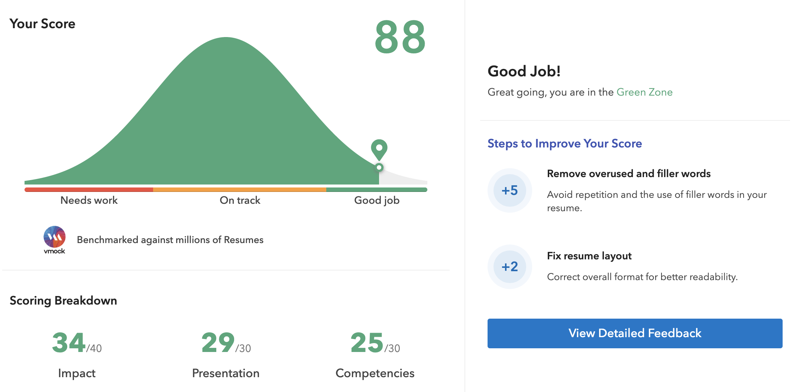

# \[CH\]-16-王丹妤 MFE @ EPFL

## 写在前面

我的申请季真的很漫长，10.14递交了第一份申请，12.6收到了第一封录取信；今年3.30递交了最后一份申请，截止到4.12我还有5个项目没有出结果。

其实整个申请季挺普通的，因为自己背景就挺普通的，没有全聚德、也没有大满贯、更没有中彩票。申请的项目基本是美国的量化金融类硕士项目，自己全程DIY申请、连半DIY都舍不得请。申请的时候感觉还挺难熬，但是现在回想也就那么回事儿，那就给大家分享一下我DIY申请的过程和心得。我尽量复盘自己整个申请细节和想法，所以全篇内容有点长，请见谅～（也希望有人看看吧）

## 基本背景

三维

> GPA 3.84, ranking 3/57 (申请用的是这个成绩，秋季学期结束后排名就跪了)
>
> TOEFL 105 (S23, W28)
>
> GRE 155V + 170Q + AW3 

实习（这个在金工申请中比较重要，放在这里说明）

> 私募量化研究 (19.2—19.6)：策略开发相关工作
>
> 工银信贷管理 (19.7—19.8)：比较水，但还是学到了不少知识
>
> 平安集团风控部 (19.10—Present)：在系统性风险团队support项目

## 申请结果

最终去向：MS in Financial Engineering @ EPFL (瑞士洛桑联邦理工学院)

录取结果 (按通知时间排序)：

- **AD\(6)**
  - MS in Quantitiative Finance @ NYU Shanghai&Stern (15k$奖学金)
  - MS in Financial Engineering @ NYU Tandon (8k$奖学金/year)
  - MS in Financial Engineering @ USC 
  - MS in Computational Finance and Risk Management @ UW Seattle (有面试)
  - MS in Quantitative Finance and Risk Management @ UMich Ann Arbor
  - MS in Financial Engineering @ EPFL 
- **Rej(3)**
  - MS in Finance @ MIT
  - MS in Computational Finance @ CMU 
  - MS in Financial Engineering @ Cornell

- **Withdraw(5)**
  - MS in Financial Engineering @ NTU
  - MS in Financial Mathematics @ UChicago
  - MS in Financial Engineering @ Columbia (有面试)
  - MS in Quantitative and Computational Fianance @ GaTech (有面试)
  - MS in Financial Engineering @ Baruch

## 申请过程/攻略/吐槽

### 前期准备

【大一入学到大三下结束】

- ##### GPA及相关课程

如果你真的很想去美国或者英国读finance/business类研究生的话，**请重视GPA，真的很重要！**我觉得GPA在美研申请中真的是致命因素，在某些项目中GPA的劣势靠实习或者GT成绩都不能弥补。我自己大一的GPA其实并不高，全靠大二大三拔上去，足足拔了两年，真累啊。自认为自己申请的最大也是唯一的优势就是这点GPA。

这里有两点提醒一下：

1. GPA成走高趋势比较亮眼。

2. 数学/计算机/金融这三类课程分数差异别太大，因为金工/金数类申请强调复合背景，如果这三门课差别太大可能会让对方觉得你编程或者数理能力不太行，形成劣势。

另外，在申请金工类成绩单上课程也有些要求：

1. 数学类：微积分、线性代数、概率论和数理统计[必需]，微分方程类、随机过程、时间序列分析、多元统计分析等[多多益善、甚至可以拉高绩点呢]。
2. 计算机编程类：所有相关项目都要求申请者掌握至少一门编程语言，我这里推荐学校里的课程是DSAA和C/C++编程。
3. 金融类：偏向量化类的课程比如金融衍生品、计量经济学等。
4. 网课：Coursera上可以申请奖学金免费上网课，也可以在上面选一点相关课程，申请的时候也可以提到

- ##### 语言成绩

  商科金融类研究生的语言要求会比一般工科研究生高一点。我个人感觉在申请季时间有限的情况下，如果TG有105+/325+，基本就可以放宽心了。我个人认为，托福/雅思相较于GRE重要一点。

  - ###### 顺序安排

    有不少人说如果你英语底子好可以先考出GRE再考托福。我曾经也认为我英语底子不错QAQ，于大二下的暑假考出了314的感人成绩(大约半年的备考时间无效)，这个暑假两个月备考托福，拿到了另一个感人的86。最后我还是乖乖在大三上学期一边刷六门专业课一边备考托福，于19年1月份考出100+的半分手成绩；大三下学期一边实习一边背单词刷GRE，于19年6月份分手；申请季的时候在10月份刷出105的托福，彻底刷完TG。所以在这里建议学弟学妹们在大三暑假之前把语言都搞定，至少要把托福/雅思成绩搞定，因为语言水平测试成绩有门槛线，GRE没有。

  - ###### 心态问题

    语言考不出来是很难受的，我大三上的时候就特别难过，周围的不少同学已经TG至少考出一门了，然而我啥都没有，心态小崩，甚至动了保研或者HK研究生的念头。但如果真的想闯出去的话，还是不得不逼自己一把。当时调整心态的办法就只能是少想多做了，恰逢是我专业课最多的一个学期，我的安排是主业托福，副业是专业课。除了期中、期末考试周及final project，我每周都会挤出很多时间学托福，课程的事情我都在周一到周五解决，余下的双休日我几乎都贡献给托福。准备的时间多了，上考场的时候心态自然会好一点、不至于太虚。

  - ###### 托福备考建议（精简版）

    阅读：练习遇到错题，回到原文相关段落进行精翻，把句子与句子的逻辑关系理清楚，对每篇阅读的段落进行概括

    听力：同样，听的时候注重句子与句子的逻辑关系；以听为主，笔记为辅；练习的时候反复听，不看原文

    口语：(suggestions from CLE)对着镜子练习口语题；一道题说到完美为止；练习的时候注意时间分配情况

    作文：多写，大作文写到500字以上、小作文写到320字以上，作文分数27+没跑

  - ###### GRE备考建议

    刷机经题，这个方案推荐给一个托福90的朋友、他半个月GRE考出319

    **认真背单词**，第一次考的很差原因主要是背单词很不认真

  - ###### 一些tips

    别急着进考场。我自身是一个心理素质很差的人+非考试型选手，所以最后几次考试在候考室做了稍久的心理建设，我会让自己的气息变得平稳、心理方面准备好了再进去（监考人员基本都会催着我进去，“就等你了！”）。我感觉自己这样在考试的时候才会比较淡定、不会急躁。

    托福口语考试前吃一个苹果，清爽点。

- ##### 实习

  美国研究生排名参考的一项重要指标是研究生的就业率，所以招生办会偏好有全职工作经验的申请者(可以拉高就业率)，但应届生申请都没有工作经验，所以只能拼实习。[15级筱一学姐](2019-Fall/docs/申请注意事项/[US]15-MathFin&MFE的一点微小的经验.md)也强调了实习的重要性，申请tier2 以上的金工项目，实习中一定要有一段quant相关的实习，可以是在券商金工、也可以是在私募。个人觉得国外的prof应该都不认识国内那几个头部券商lol、更不知道层次如何，所以大家可以**把重心放在实习内容上**，而不是title。

  我的第一份实习来自金融群系秘书发的广告，投简历之后有Python笔试，面试问题不大，拿到了Python开发岗的实习机会，但因为那个时候大三上课程安排紧张不能及时到岗，东家未给我保留职位。寒假我积极争取，拿到了东家的策略开发实习。有的时候，**机会真的是争取来的！**

  珍贵的暑期实习因为种种原因错过，水过，真的惨。

  第三段实习来源也是金融系同学在群里发的广告。投简历之后HR通知面试，等待结果两周后通知到岗。虽然实习开始时间比较晚，但是工作内容挺丰富有意义，所以申请的时候也把这段经历写在了CV和文书当中。

  - ###### 时间安排

    厉害的大佬可以在大二暑假就开始一段不错的实习，这对之后找更好的实习有很大帮助，职业道路步步高升。我在南科大前两年半的规划是刷高GPA、刷学分和搞定语言成绩，搞定这两个申请HK的研究生和保研基本没什么问题，所以我的第一段实习开始得比较晚。之后就有大把时间用来实习或者做科研，我没有翘课实习过，时间都是两方安排好。另外，在和东家交代自己实习时间的时候**请务必诚实**，欺瞒造成工作延后会对南科大造成不良印象。

  - ###### 实习资源

    各种实习交流群（包括金融系QQ群），各种公众号（微信里随便搜索一大堆），学长学姐内推等。

  - ###### 实习的其他帮助

    实习不仅是为了申请到好学校，其实也有很多potential benefits。比如认识很多业界大佬、拓展人脉、培养自己的交流沟通能力、知道怎么写email、培养multi-task能力等等。我甚至感觉实习多了，人做事情会开始有条理，自己在写文书的时候思路也比较清晰，感觉是在平安实习的时候培养出了逻辑能力。

    

- ##### 海外交流

  基本上申请者都有或长或短的海外交流经历，但是我个人觉得对于金工硕士项目申请来说没有太大作用。

  我总共<u>申请到</u>过三段海外交流：UBC商学院暑期交流、哥大Columbia College学期交流、亚利桑那大学商学院暑期研究。后两个因为各种原因放弃，但是后两者的申请也算是在模拟申请研究生了。哥大的交流需要写三篇essay，暑期研究需要写一篇Statement of Purpose，基本都是自己完成的、找了下CLE的语言老师修改。当时感觉写文书挺有意思的，尤其是思路想通之后，也算给自己DIY累积点自信。

- ##### 比赛/奖项/课外活动等

  我个人感觉在申请美国研究生的时候校内比赛或者奖项荣誉没有太大用处，反倒是不起眼的课外活动比如志愿者活动、校内的一些社团、公益组织甚至是一些小有成就的爱好能在海量申请者中凸显自己的uniqueness。

  

### 开始阶段

【大三暑假到10月中旬】

- ##### 选校定位

  我是在暑假的时候，翻遍了各大论坛的录取信息以及从各大中介手里搜集一些学校和项目的介绍，基本上时候按照往年录取人的背景作为参考。具体相关的选校信息可以参考[筱一学姐](2019-Fall/docs/申请注意事项/[US]15-MathFin&MFE的一点微小的经验.md)的介绍，我就是参考她的文章选校，内容很详细～

  金工的硕士项目可以申请8-15所，视个人申请实力而定。选校档次最好为倒三角形，保底两所最多了，主申学校3-4所，剩下的都去投彩票项目吧。最后去的学校一定要有性价比，且对得起自己三年多的努力。我个人是综合排名和专业排名一起看，所以一些国内不太知道的学校我就没投，即使它们在美国本土声名显赫。

  另外，最后的选校list我也询问了在美国读金工项目的学长学姐，还有我的妈妈，毕竟是父母掏钱让我去读硕士，父母有权利嫌弃低于他们预期的学校。

  

- ##### 套中介信息

  暑假在扒拉各种学校的时候会看到很多中介广告和他们的联系方式，类似“添加小助手vx，免费了解更多申请信息“。这种白嫖机会我是一定不会浪费的，我加了之后基本上就告知他们我的基本信息，让他们帮忙定位或者提供一些整理好的选校信息。遇上nice的中介，他们甚至会主动给我一些文书资料lol。事实上，他们提供的资料也没有给予太多帮助，选校的建议我也没用上(我的投递比他们建议的高了一个tier)，毕竟天下没有免费的午餐。至于我为什么没有请中介，我后面会写。

- ##### WES申请

  我没有申请WES，一个原因是绝大部分学校不需要或者不接受WES，另一个原因是价格昂贵、没有必要。但是如果想要申请JHU硕士项目保底的同学，建议办理，听说这个过程挺慢的，尽早办比较好。

- ##### 推荐信人选确定

  我选择了熟悉自己的老师、能够凸显自己量化能力的老师，并且挖掘了一下素材，提前和老师联系。
  
  
  
- **参加了一个美国高校教育展**

  9月份的时候我通过托福公众号看到EducationUSA邀请了四十所美国高校在深圳举办教育展，我参加了。虽然里面没有几所顶尖高校，最好的应该是JHU、NYU Tandon和NEU了，但是我的收获挺多的，在这里分享给大家！当时Tandon的宣传人员是一名来自湾湾的很可爱的大叔，他给我提供一些不错的信息：

   1. 提早做准备，尤其是寄成绩单

   2. 推荐信不必太在意教授有么有名气，对你了解的老师更能吸引眼球

   3. **提前和项目director“陶瓷”**，这一点我没有做因为实力太虚。这一个的目的主要是“混脸熟”，邮件内容委婉一点说，比如我很想加入你们的研究生项目(附上简历)，您觉得我还需要怎么提升？

   4. (他在纸上画了一个正态分布曲线图，以下内容是<u>他个人想法仅供参考</u>)横坐标是GPA和GRE成绩，纵坐标是人数。他说发offer的时候位于+3倍sigma的同学基本不看其他材料直接发offer、位于-3倍sigma的同学直接发拒信。中间的同学们(画上阴影)，招生办就会在看根据的文书、实习、推荐信等有没有亮眼之处来判断要不要发offer。

      

- ##### 简历基本拍定

  我在十一假期搞定了中英文简历，敲定了绝大部分内容。当时听同学介绍可以在闲鱼上找人帮忙修改简历，我就找了一位复旦的小姐姐修改我的中英文简历。她先给我讲了一小时我之前中文简历出现的问题，我为我原来糟糕的简历还能找到实习感到震惊，再告诉我如何写好简历中科研或者经历的内容。在此强烈推荐简历修改中**使用STAR法则**。

  我觉得简历在申请中也很重要，一份好看的简历能给对方教授留下好印象。我是用word做的简历，也可以用ppt做，方便排版。首先，**一定要简洁看着舒服**，即排版要整齐、字体好看(推荐使用Calibri)、整份简历中字样种数不超过三种，因为申请者众多，教授不会花太多时间看你的简历，最多一分钟左右扫一遍，美观程度是很致命的第一印象；其次，在内容上一定要**突出量化能力**，你可以通过你的模型结果[e.g. R square]、处理多少量级的数据等来说明；在说明每一个bullet point的时候，运用我上述提到的STAR法则；注意用词丰富，可以Google一些同义词网站来寻求花样。

  另外，朋友向我安利了一个外国修改简历的网站—[VMock](https://vmockresume.app.link/tnCLlVCdK1)，这是一家给美国众多高校给学生简历提供**自动修改建议**的平台。听说某些高校在招生的时候也会用该平台筛选学生简历，85分以上算是优秀的简历。点击链接注册后，可以上传一份自己的简历，系统会给出各个方面的评分和修改建议。

  

### 主要阶段

【十月中下旬到一月上旬】

- ##### 网申填写

  确定选校后，我开始开启每一个网申系统、注册账号、填写基本信息。可以用一些琐碎/效率低的时间来完成这项工作，美国的网申表格不算复杂，细心、耐心点就是了。

  因为网申的问题和询问信息比较相似，我建了一个Excel表格记录基本信息(包括获奖荣誉和工作经历)，填写的时候可以直接复制粘贴了。另外在过一遍网申的同时，我把一些文书的要求和是否需要录制video的情况记录下来，以便后续安排申请递交计划。

  

- ##### 制定计划安排时间

  我用Notion软件做了一个表格，记录了所有学校的截止日期+各种材料准备情况，以防遗落。我根据截止日期和项目之间的相似性，制定了申请投递计划，12月份里平均每周我都会投递两所学校。

  两所保底校分别投递时间是10.14和11.14(提前了截止日期一个月)。我觉得把差一点的学校在前面申请一个是有模拟作用，前面犯的错误可以警示后面主申校的申请；以及文书和简历可以一直调整完善，我现在看来我前两个文书写的是真的烂。

  

- ##### 文书

  文书是整个申请过程中最让我崩溃的部分、也是我收获最大的部分，即使文书远不如GPA来的重要。

  在开始自己动手写文书之前我查阅了很多关于文书的资料，很多关于文书的信息和建议我是Google出来的，从中介的客服那里也白嫖到一部分文书资料。我总结了一下，文书大概就是一个你告诉学校“Why I need you & Why you need me”的过程。我觉得写文书有趣的地方在于，**对自己人生的一个清晰而又有深度的挖掘**。

  - ###### 研究项目官网

    最开始要了解的就是项目的课程设置和培养方向，就好比在招聘之前要先看清楚job description再和自身能力匹配。有些项目写得比较详细，可以看到每一门课的介绍，我就是在这些介绍里面寻找和我未来职业道路契合的部分；如果没有写的很详细，就随意脑补一下吧。

  - ###### 挖掘素材

    我当时按照文书的逻辑顺序想的素材——motivation、career goals、academic/professional achievements。在申请季之前我从来没有想过自己的职业道路，因为申请“被迫”认真思考了这个问题，从此人生不再迷茫。

    motivation和career path我大概想了有段时间，如果想的东西比较随意，写出来的效果不会显得很诚恳，一定要体现personal，尽量避免烂大街的想法，哪怕你真实的初心确实很肤浅，也要多想点有意义的原因去体现自己的真诚。我的career path也是受我的两段实习启发以及自己的价值观驱使敲定的，我觉得这个还是很重要的，也是能体现你unique的地方，能够让教授们把你在池子里捞起来。

    前期在编写简历的时候，基本上过了一遍自己的学术经历和实习经历，具体的achievements比较清晰了

  - ###### 写文书

    动手码字前我会画一个提纲，先写什么后写什么，让整个文书显得有逻辑。因为我申请的项目几乎类似，所有文书基本内容不会变，但是具体的侧重点根据项目要求和特点调整。商科类的文书风格会和纯理工科有点区别，前者我会写的有点“文艺”、带一点情感色彩在里面，后者可能单纯讲科研细节多一点。

    另外，我觉得文书不是简历的拓展版本，不必把一些重复的信息再放进、比如GPA之类的。多写点自己的想法和细节，体现一下自己的灵魂。

    其实南科大学生的第一份PS应该都是在大一上的学术英语完成的，至今记得外教告诉我们PS的段落结构类似于汉堡XD

    我的SOP结构如下，表格可能有点丑，不喜勿喷：

    | 段落数 |       段落核心内容       |                           举例说明                           |
    | :----: | :----------------------: | :----------------------------------------------------------: |
    |   1    |        motivation        |           杭州P2P狂爆雷，我好心痛，我要改变现状！            |
    |   2    |   academic achievement   |      我本科哪里的，选了哪些课，在这些课里我做了什么项目      |
    |   3    | professional achievement |     我在哪里实习的，写了什么样的代码、解决了什么实际问题     |
    |   4    |       career path        |           毕业之后我要做什么；十年之后，我想成为谁           |
    |   5    |        why school        | 贵项目真的能帮助我实现职业梦想，您的课能够如何帮助我哪方面的能力；我配得上您 |

    PS的结构大体类似，但是我里面会贯穿一个像小故事一样的东西，比如说我从很害怕写代码到能在实习中用代码support项目。

  - ###### 改文书

    **强烈推荐Fiverr**这个网站，虽然我知道大家都习惯性去CLE老师去修改而且是免费的，但是我自己接触下来感觉Fiverr上修改的更好、交流的也更充分。因为文书中会涉及一些专业名词，专业这块的内容可能CLE老师了解并不多，所以我当时也是在Fiverr上找有理工科背景的人来修改。申请Tandon的文书我是在上面花了100软妹币找了个印度小姐姐、她是UWM的EE硕士，她改得很专业，文章中的文笔真的流畅，三姐的英语水平6得不行，我给跪了。我只找了她一次，后面的文书我都基于Tandon的文书进行修改。

  

- ##### 面试

  因为金工算是美研中最激烈的项目之一了，所以申请过程中会安排不少的面试；以GaTech为例，申请需要提交一个video essay，过了两个月还会有真人来面试你，真的有点麻烦。整个申请季下来，我录了6个video essay + 3个真人面。

  对于机器面试我也没啥靠谱经验QAQ，应该就是注意仪表、口齿清晰啥的吧。

  经历的三次真人面都是行为面、没有太多技术型问题，大概就是想了解一下你的motivation和沟通能力吧。第一次面试是在图书馆，网卡的一批，断了好几次，只好一个劲和对方说sorry。第二次面试，凌晨两点，脑子很糊，幸好就问了十分钟。第三次面试，感觉聊的挺好的，但是对方貌似不想要我。
  
  

## 哔哔几句

> 为什么选择出国而不是保研

南科大16级保研比率真顶尖985水平，并且今年金融系保研结果很出彩，保研在妮可看起来越来越香。我在大三下的时候好好考虑了这个问题，并且做出了选择。有以下原因：

1. 喜欢迪士尼\皮克斯十几年、很想去打卡北美的国家公园，所以我非常及其特别想去US生活一段时间(然而去了瑞士)
2. 我自己还是不太能接受国内传统的高校教育模式(全都是南科大给惯坏的嘻嘻)，包括我的父母，他们也非常支持我选择出国那一条路
3. 我的成绩、获奖荣誉在保研中并不占优势，可能保研结果不如出国读研
4. 当时在私募实习的时候，左边是清华小哥、右边是北大汇丰小姐姐，我向他们请教了不少关于国内保研和在读体验，总结了一下还是出国吧

当然国内保研也有不少好处，比如省钱、刷实习方便，但是从长远利益和个人想法来看，我选择最难最繁的一条路

> 为什么不请中介，包括半DIY中介方式

我身边申请master的90%的同学都找了中介，我身边没找中介的同学基本上是申请PhD的，自己申请其实挺辛苦的、我也时常羡慕那些请中介帮忙的朋友们。原因有以下几点：

1. 抠门
2. 中介太贵
3. 中介协助方式也是要先和学生沟通交流，我觉得这个过程真的很麻烦，并且信息传达的过程肯定有遗漏或者理解错误。<u>我个人感觉</u>，他们会给你洗脑，不会以你的内心想法为重
4. 本人脾气并不温柔+对乙方要求高，我感觉申请季宝贵的时间还不够给我用于跟中介吵架撕逼的，我不是特别信任市面上的中介。

如果申请季时间超级紧张且不想gap，请中介协助你是唯一的方式了。

> 为什么没有申请BA/Finance和其他方向硕士

最主要的原因还是想搞金融风控这条路子。并且因为懒，方向不同、文书和简历的思路会很不一样，不想折腾第二套方案。

BA很火、美国高校都纷纷开设BA、DS方向硕士，但我个人对BA找工作和未来发展持保守态度。我一直很想去金融业发展，BA的覆盖面大因此对金融类工作优势不太大；并且认识的一个利益相关的大佬认为我的背景不适合BA申请；顶尖的Finance硕士竞争比金工更激烈，并且偏好美本，finance提供的技术课程不如金工；从升学成功角度来看，申请本科专业的研究生轻松一点，也符合未来职业规划。

> 申请中的心态

我的保底校录取是在12.6，当时大部分的学校我还没投递，所以整个心态比较好。建议大家早点投递一些通知时间早的保底学校，这样在之后的申请中不会消极怠工。然后是漫长的两个月，一月底来了一个拒信和一个录取，后面大概每两个礼拜来个消息吧，所以也没太蕉绿。（反正这个疫情录了也走不了orz）

> Why EPFL

我第一次知道这个项目是在大三上，如前文所言、那段时间我对自己是否能去美国很怀疑。所以我就东看西看，发现了这个宝藏项目，他家的项目很硬核、类似于金融科技方向。并且校园环境绝美，还没有学费。EPFL也算是欧陆top3了，这个项目我在心里种草了一年半。虽然这个项目没有美国那些项目听起来厉害，但是我还是想选择未知的挑战，exploring more possibilities!

## 再哔哔几句

#### 致谢

❤️ 谢谢替我还信用卡债务的爸爸，我用的是子卡、每消费一笔我爹就来问我你干嘛了，也时常让我申请搞快点，	  是我申请的最大驱动力；也谢谢我的妈妈，是她让我勇于尝试MIT，当然我也让她失望了，没有听她的话去尝   	  试哈耶普斯等: )

🧡 谢谢给我写推荐信的每一位老师和实习中的advisor

💛 谢谢给我提供实习机会的每一位东家

💚 谢谢CLE给我提供托福、简历、文书建议的每一位老师

💙 谢谢申请季中互相卖惨的每一位朋友，卖惨好减压QAQ

💜 谢谢南科大四年前给我机会，如果当时没有南科大捞我，我就不是今天的我

#### 广告

鄙人帮身边的几位朋友无偿修改过文书、简历等，他们反馈不错，不知道是不是在安慰我。Anyway，愿意帮未来的申请者们提供一点微弱的帮助。联系方式戳QQ953878740 >.<