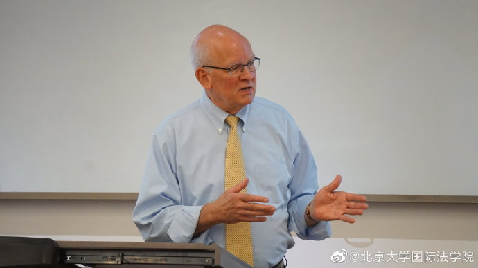
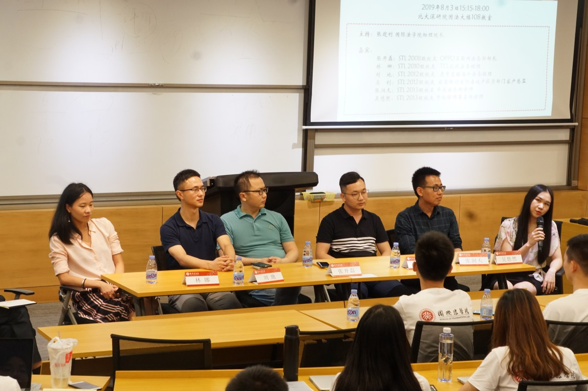
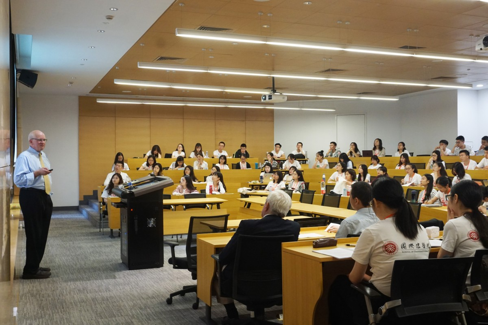
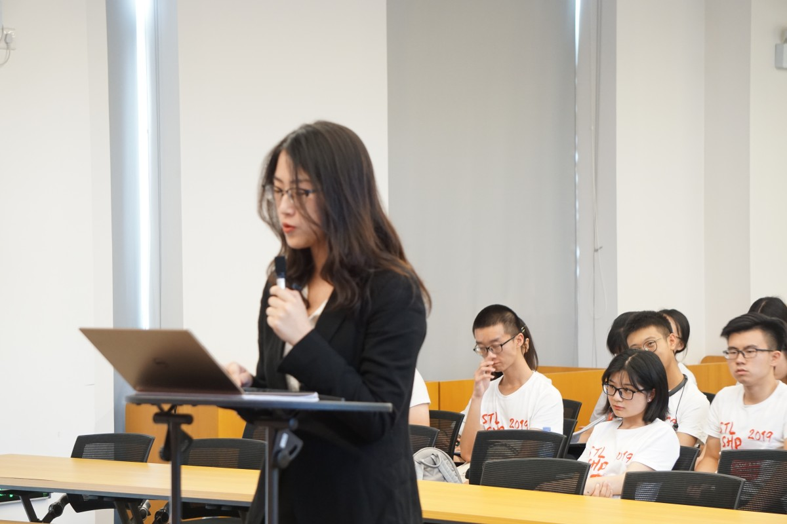
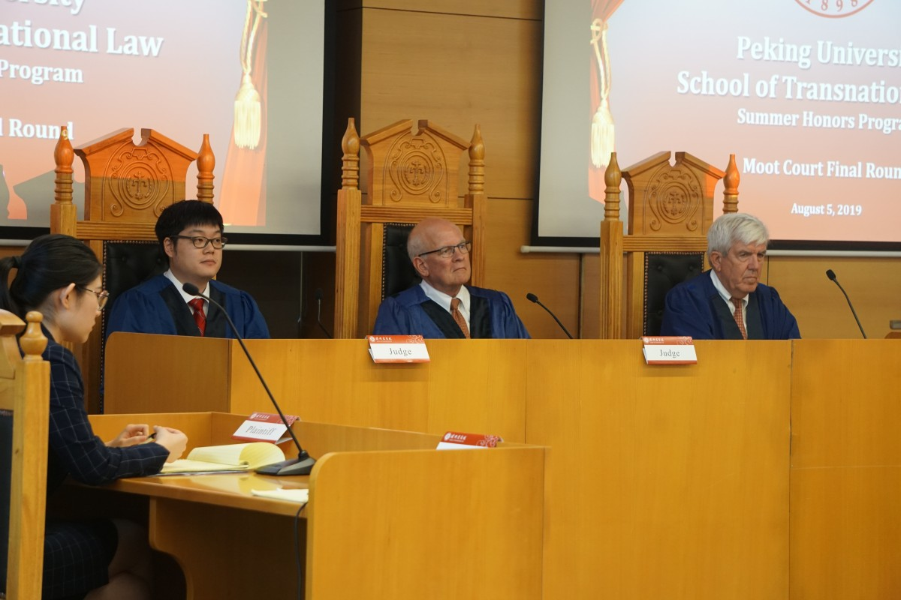
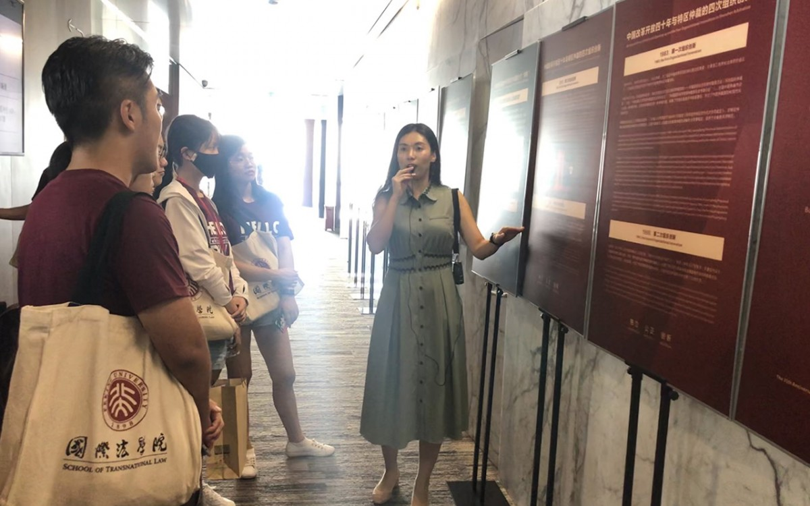

# [CN]-16-公国钰 保研 @ 北京大学

### 基本背景

> 姓名：公国钰
>
> 专业：金融工程
>
> 学术导师：何佳
>
> 绩点（排名）：3/58（3.85/4.0）
>
> 去向：北京大学国际法学院
>
> 联系方式：微信 ggyzsz

**首先，十分感谢保研路上无私给我帮助的老师们和学长学姐们：学术导师何佳老师、生活导师郝祁老师，栗沛沛老师、严硕老师等金融系的各位老师，西贝学姐、蔡多学姐、雪儿学姐等金融系的学长学姐们；十分感谢一直在背后支持我的家人们；十分感谢在南科大和在国外遇到的志同道合的好朋友们，非常非常幸运，非常非常感恩。**

我能成功保研北大国法既在意料之中，也在意料之外。意料之中在于，我对STL项目十分认可、对美国法学院教育有过实地了解，我的经历也契合STL的选拔条件。意料之外在于，保研这件事我没有详细周密的规划，回国之后才开始准备材料，导致整个夏天过的比较匆忙。赶学校申请ddl的时候也抱怨过为什么自己没有早早制定保研的计划，这样也不会承担这么高的风险。但是，回头看却也并不后悔自己在大学里的每一步的选择，因为那都是当时的自己最想要最喜欢的选择。如果没有提早出国交流，我也不会明白自己真正想要什么，也就不会坚定地回国保研。所以我没有详细的保研经验，但希望能分享自己参与保研的原因和感受，为后来的学弟学妹们提供借鉴。

### 保研非法硕缘由

因为最初打算申请出国读商科/金融master并在海外工作几年，所以我大学期间积极地参加了许多海外学习项目，包括加拿大英属哥伦比亚大学、牛津大学、加州伯克利。通过这些项目，我有意向地选择留学国家、找教授拿推荐信等等，为之后的申请准备。后来在加州深入了解了中国商科学生在海外的就业情况，也全面地认识到自身条件的优劣势以及自己未来的职业发展方向。

出国前，导师推荐我选修一些法律的课程，所以我在伯克利上了有关知识产权、创业与法律、协商与调解之类的课程，认识了许多国内外的法学同学和律师，对美国法学教育有了一定的了解和认识。在知识产权的课堂上，当谈论到华为的案例，我深刻地感受到中美法学教育以及中美法制的差距。而且，伯克利有许多复合专业和课程；许多科技前沿类的课程（比如虚拟货币等）都有商学院和法学院同学的身影；我最喜欢的商学院教授也是J.D.出身……所有这些都给我留下了“商法不分家”的印象。后来，学法的小伙伴向我推荐了北大国际法学院的项目，加上自己本身对跨境贸易很感兴趣，所以抱着试一试的心态回国报名参加国法的夏令营。

### 北大国法介绍

北京大学国际法学院（Peking University School of Transnational Law, 简称“STL”）创立于2008年，是中国也是全世界范围内，唯一将美国法律培养模式（J.D.）和我国传统的法律硕士培养模式（J.M.）相结合培养法律人才的法学院。学院创院院长为美国康奈尔大学前校长、上海纽约大学常务副校长、2011年中国政府“友谊奖”获得者、改革开放40周年40位最具影响力的外国专家之一Jeffrey Lehman教授。现任院长Philip McConnaughay历任宾夕法尼亚州立大学法学院院长和国际关系学院的创院院长、伊利诺伊大学法学院教授，并曾任顶级跨国律所美富律师事务所的合伙人。美国耶鲁大学法学院原副院长Stephen Yandle担任副院长。学院师资力量雄厚，并聘请世界著名的法学教授、著名大法官和杰出律师担任访问教授。

（Philip McConnaughay院长）

### 夏令营

STL夏令营最核心的活动是moot court模拟法庭比赛。如果夏令营能通过筛选这一关，就不用太担心这个比赛，因为会有相应的体验课程教大家比赛规则以及需要做些什么。夏令营的材料需要中英双语，由**院长亲自筛选**，因此申请材料筛选算是最难过的一关。个人体会是国法比较看重personal statement，因此要充分说明为什么北大国法是最适合自己的项目，这一项相对于国内其他非法学法硕专业申请有很大不同，更像申请海外院校。

具体的活动以及准备有国法学姐已经讲的很清楚啦，对这个夏令营感兴趣的学弟学妹如果想了解更多的话可以看下文链接。https://mp.weixin.qq.com/s/cIV3wGfuiF-BFrPjKvn24g

 （与毕业的学长学姐们交流）

（院长与营员交流）

（模拟法庭决赛）

 （模拟法庭决赛）

（深圳国际仲裁院参观）

### 个人感悟

1.对于纯商科（纯金融/营销/管理等），如果无法留在国外工作，出国读master的性价比不是高，当然学校排名靠前、家底殷实除外。因为在加州那边了解的情况是，中国留学生学纯商科留在国外工作的可能性很小，对英语的要求极高（竞争对手基本都是native speaker）；计算机、金融工程、金融数学等偏理工类的商科留下工作的情况比较多。现在英国留学签可以申请两年工作签，如果能在国外工作几年回国，是相对好的选择。

2.若想保研名校金融专硕，成绩排名非常重要。硬性指标重要程度：成绩排名>英语>实习>科研。想保研名校金专的同学，可以多看看保研成功经验贴，对自己需要哪些条件有所准备。

3.STL非常注重个人经历，即使排名非第一第二也可能得到机会。如果有对法律/投行/辩论/跨境贸易等感兴趣的学弟学妹，不妨一试。

 

**转载需联系作者本人**

 
