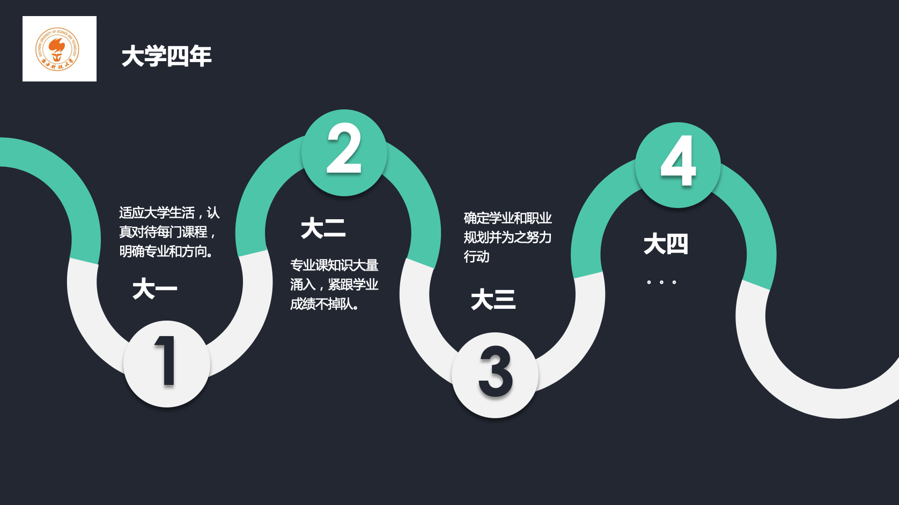
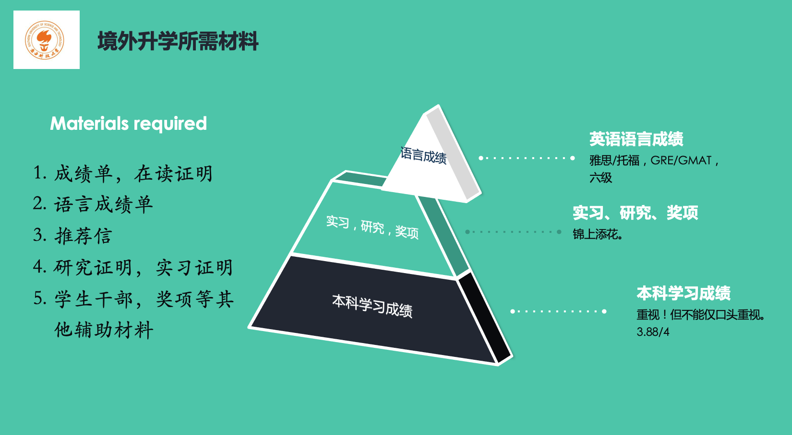

# [SG]-16-李一林 MS in Financial Engineering @ NUS

### 基本背景

> GPA: 3.88
>
> TOEFL: 105 (30+27+24+24)
>
> GMAT: 720 (50+37)
>
> Offer: National University of Singapore

我是2016级金融工程专业的李一林，很荣幸能够受邀请在这里给大家分享关于境外升学的一点经验，其实难言经验，只是我个人在申请过程中的经历。我本身不是特别认真优秀的同学，但是因为目标比较明确，一步一个脚印，最终申请的结果还算比较理想。在2019年9月11日，我接到了新加坡国立大学金融工程专业2020秋季入学的提前批录取通知，再次向申请期间给予我无私帮助的老师和同学表示感谢。我希望通过我的经历能够让大家了解申请境外学校的流程和一些注意事项，早做打算，尽快迈出第一步。

文章成文之际正是农历庚子鼠年新年来临之时，也是新型冠状病毒感染肺炎疫情扩散阶段，首先祝各位老师和同学新年快乐、万事如意、身体健康！

 

我想和大家，特别是大一大二的同学，探讨的第一个问题是大学期间的整体规划。大学四年看似很长，实则在每日重复的学习生活中转瞬即逝。学校的课外活动很多，学业压力也不小，作为学生很容易被这种节奏带着走，慢慢迷失了自己的方向。为避免这种情况的发生，最重要的方法是尽早设定自己的阶段性目标，并在日常学习生活中按部就班地准备和完成。就我个人的经历而言，大一是大学阶段的适应期，要适应的有很多，比如大学的学习节奏和学习方法，英语教学带来的阶段性障碍，社团活动和学生兴趣组织的参与，以及个人健康生活作息的养成。我们2016级实行的是2+2的教学计划，通识必修课既多又杂，包括物理化学数学生物等等，现在已经有1+3的新型教学计划，为早早确定专业方向的同学提供了尽早进入专业的途径。对于暂时没有确定专业的同学，可以综合考虑，等到大二结束再做决定。我个人其实很推荐大家多了解专业课程后再确定专业方向，除了确保兴趣使然之外，在跨学科、交叉学科大行其道的今天，扩展知识面提高知识储备也是很重要的。另外，通识阶段的课程也都不难。

提到整体规划，一个绕不过的话题就是大学四年毕业后的选择，因为不同的选择带来的规划是不同的。南科大同学毕业后继续深造的比例大概占2/3，其中包括了境内升学（保研考研）和境外升学，还有1/3的同学选择了就业创业。尽快确定自己想走的路能够让你在同行者中走得更快更稳，其中走有些路线需要准备的行李是类似的，比如境内升学（保研）和境外升学，这也是南科大毕业生选择最多的方向。但也有的路线相隔较远，不能同时走，比如考研和工作。对于大一和大二同学来说，在大学学习和专业深入的过程中要根据自己的兴趣至少选择一个大方向。举例看，有的同学在保研和境外升学之间举棋不定，可以两线程同步推进，因为两者相似程度很高，比如都需要优异的日常成绩，学科竞赛奖项，学术科研论文，实习和交流经历等，区别可能在于所要准备的英语成绩类型有所不同，保研需要参加大三暑期的夏令营等，但这些不同点也是由前面共性所培养的能力产生的。2016级同系有几位优秀的同学就是前期按照境外升学准备的，也考了托福和GRE的成绩，大三下学期经过一定准备，暑期参加夏令营获得了推免资格，就直接走了境内升学的路线。之前有学弟学妹问过“最迟什么时候要确定自己最终走哪一条路”这个问题，我的个人意见是这个不是和赶作业ddl一个类型的事情，条条大路通罗马，每一条路都能走出一片天，越早确定就越早能够有针对性的准备，最后的成功率也越高。如果一定要确定一个时间点的话，那应该就是大三上学期期间，要确定自己选择的具体方向。

我个人很早就确定了境外升学这条路线，大概是大二期间。选择的原因无疑包括了南科大国际化的优势和资源，还有个人希望继续深造的目标。在我刚入学的时候，南科大第一届本科毕业生刚刚毕业，学校还没有博士点和硕士点，境内升学的窗口相对狭小。现如今这一状况完全改变，本校博士硕士点建成，境内升学既可以留在本校继续科研攻关，还可以在推免阶段根据自己的兴趣申请国内顶尖高校。希望大家能够搭上学校发展的火箭，利用优质资源实现个人价值。话说回来，在大二选择好路线之后，我开始在紧张的学习之余计划准备申请所需材料。所谓寄往外校的申请材料包括了以下几种：成绩单，在读证明，语言成绩单，推荐信，研究/实习证明，学生干部和奖项等其他辅助材料。我就不展开说了，相信大家也阅读过不少这方面的内容。我想问大家，你们觉得最终卡住大多数同学的是其中的什么？

答案是语言成绩（托福/雅思，GRE/GMAT）。不知道小问号是否会有很多朋友:D，如今毕业申请季已近结束，我看到身边的同学的“阿喀琉斯之踵”多为英语成绩单。有的同学因为英语成绩不足失去了梦想学校的申请机会，有的同学大四申请季中还陷入反复参加考试的挣扎。新冠疫情席卷全世界，导致2020上半年各类考试大面积取消，那些拿到条件录取的同学内心是复杂的…所以英语成绩这个约束条件大家千万要重视，日常课业之余要多加学习。目标分数要达到托福100+/雅思6.5+，对于GRE和GMAT按照官方给出的数据前10%的分数是330/700，达到线就可以。此外，随着认可度逐渐提高，四六级成绩也变得重要起来。我考英语的时间是这样的，大一下（2017-06）报名四级并参加考试（580），大二上（2017-12）报名六级并参加考试（610），大二暑假（2018-09）考托福（105），大三寒假（2019-03）考GMAT（710）。因为比较幸运，第一次考试成绩都还可以，所有考试都没有刷过分，但要预留出一定时间防止成绩不理想，切勿把考试都集中到大三下到大四期间，到时心态也会受影响。

 

补充一点关于提前批申请的事项，我走的是提前批项目，这种形式今年也是NUS MFE第一次办，6月截止申请，7月就陆续开始发录取通知，我是9月初接到通知，比著名的大四颓废党—保研党的“颓废点”还要靠前（推免录取九月底），可以说是非常省心。提前批申请对于GPA（3.7+）和托福（100+）有着严格要求，想走提前批的同学更是要早规划，早行动。有关是否有提前批项目这需要个人去学校项目网页查找跟踪，一般和专业和学校有关，亚洲的学校会多一些。

 

*写在最后，在这里啰啰嗦嗦给大家分享我也是很忐忑，希望大家看过之后能有所收获。大学时光很短暂，生活就像敌方打野，如果被他带着节奏走，恍惚之间三路水晶已破，所以要有自己的节奏和步调。“你是体育课跑步最慢的人或是世界上跑得最快的人并不重要，生活就是在一直奔跑，你不管跑得多快，你总有跑不过的东西，也总有很多东西在设法追上你。”——《闪电侠》*
