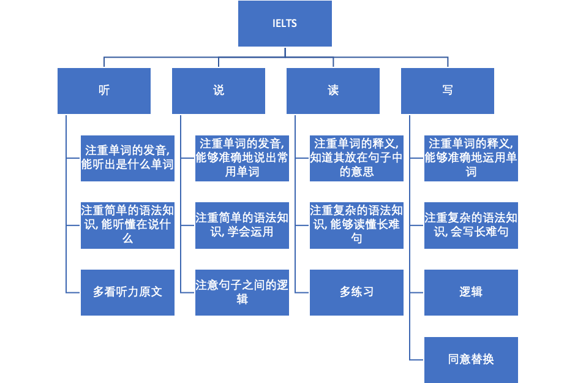
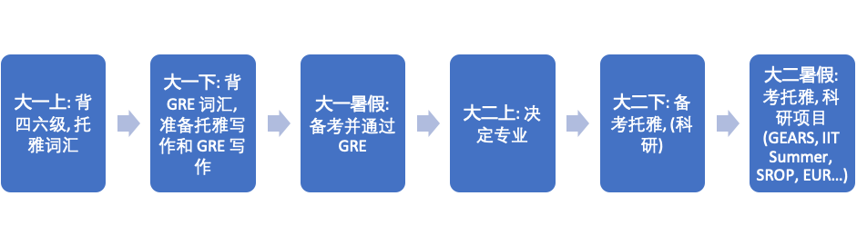

# [UK]-16-马一铭 MSc leading to PhD in Mathematics of Systems @ The University of Warwick

### 基本背景

> 数学系, 数学与应用数学专业
>
> GPA: 3.84/4.00 (92.18/100), 排名: 5/48
>
> IELTS: 8.0 (R: 9.0, L: 8.5, W: 7.0, S: 6.5)
>
> GRE: VR: 153, QR: 170, AW: 3.5
>
> 爱丁堡大学学期交流, 均分 70+ (First-Class Honours Degree)
>
> 北卡罗来纳州立大学 GEARS 项目

### 申请结果

| 学校                                              | 项目                                                        | 申请结果                                        |
| ------------------------------------------------- | ----------------------------------------------------------- | ----------------------------------------------- |
| Imperial College London                           | Applied Mathematics (MSc)                                   | Unsuccessful                                    |
| Imperial College London                           | Artificial Intelligence and Machine Learning (MSc)          | Unsuccessful                                    |
| London School of Economics and Political Science  | Operations Research and Analytics (MSc)                     | Successful,  Con 90/100                         |
| London  School of Economics and Political Science | Statistics  (MSc)                                           | Not  Considered                                 |
| University  College London                        | Mathematical  Modelling (MSc)                               | Successful,  Con 90/100 (SUSTech), 70/100 (UoE) |
| University  College London                        | Computational  Statistics and Machine Learning (MSc)        | Unsuccessful                                    |
| The  University of Edinburgh                      | Operational  Research with Computational Optimisation (MSc) | Successful,  Con 85/100                         |
| The  University of Edinburgh                      | Artificial  Intelligence (MSc)                              | No Result  Yet                                  |
| The  University of Warwick                        | Mathematics  of Systems (MSc leading to PhD)                | Successful,  Con 82/100                         |
| The  University of Warwick                        | Computer  Science (MSc)                                     | Successful,  Con 82/100                         |

### 最终去向与未来规划:

The University of Warwick, Mathematics of Systems (MSc leading to PhD)

我个人对于模拟神经元和神经网络更感兴趣, 选择了华威大学的系统数学项目, 可以从中收获更多研究复杂系统的数学模型和机器学习模型, 对于未来模拟复杂神经元和神经网络的行为模式有极大帮助.

 

但是就业总是要考虑在内的, 华威大学虽然数学系可以在 QS 上排到 19 (2020 年数据), 但是华威的 QS综合排名为 62 (2020). 回国的就业竞争上可能比拼 Oxbridge 和 ICL. 因此, 我计划在完成硕博项目后, 再去读第二硕士或第二博士, 转向神经科学和机器学习方向, 目标院校为 Oxford, Cambridge, ETH, UCL, ICL来巩固学历, 改善就业前景. 

欢迎兴趣方向相近或未来校友的学弟学妹们与我联系: [yiming.ma.prc@outlook.com](mailto:yiming.ma.prc@outlook.com).

### 申请经验分享:

#### 琐碎的英国申请经验:

* 先到先得. 申请提交地早, 院校开始受理的就早, 被录取的概率就大. 所以, 一定要申请系统一开通就申请.

* 学制. 英国同欧洲大陆的大部分院校一样, 是本科(英格兰 3 年, 苏格兰 4 年) ->硕士(授课型 1 年, 科研型 2 年) ->博士(3 年) 的常规申请流程, 但是极少数特别优秀的同学可以直博.

* 奖学金. 硕士阶段大比例的奖学金是提供给欧盟学生, 可以认为中国学生不会获得硕士的奖学金. 博士阶段学校则提供奖学金. 此外还有留基委的奖学金可以考虑. (具体看学校.)

* 申请授课型硕士需要提供的材料:

  * 本科前三年的成绩单,
  * 语言成绩 (有的大学可以无雅思申请, 但是被录取后需要在规定时间内考过雅思) (GRE: 据我所知仅 ICL),
  * 推荐信(一般为 2 封, 爱大 1 封), 
  * PS (可能要有 CV).

* 申请科研型硕士需要提供的材料:
  * 本科前三年的成绩单,
  * 语言成绩 (有的大学可以无雅思申请, 但是被录取后需要在规定时间内考过雅思) (GRE: 据我所知仅 ICL),
  * 推荐信(一般为 2 封, 爱大 1 封), 
  * PS (可能要有 CV).
  * Research Proposal

* 问清原因：被拒后一定要发邮件给 admission office 发邮件问清原因. 如果是因为南科大双非把你拒了, 一定要联系南科大的国际合作部, 让老师们帮你处理.

#### 申请的硬性条件:

* 本科院校

* GPA & 排名

* 语言成绩 (+GRE)

可认为本科院校即 GPA 为硬性条件中的最重要因素, 语言成绩则满足要求即可.

#### 申请的软性条件:

* 科研经历

* 实习经历

* 交流经历

* 竞赛

* 志愿活动

对于申请科研型项目的同学, 科研经历 > 交流经历 > 竞赛 > 实习经历 > 志愿活动.

对于申请授课型项目的同学, 科研/实习经历 > 交流经历 > 竞赛 > 志愿活动.

#### 数学与应用数学专业的学生提升软性背景的机会:

积累科研经验: 

科研经验一定要与专业相关. 本专业的同学本科很难有科研机会, 可以选择:

* 主动向 (未来的) 专业导师去要课题

* 大创

* [国合部的科研型项目](https://geo.sustech.edu.cn/hwxx/#dqjl) (大多数是短期项目)

* 自己关注下别的院校的科研机会

* 毕业设计

举例: 16 级数学与应用数学专业 GPA 第一名的徐源诚同学在大二暑期通过自己联系, 去了New York University, Shanghai, 参加神经科学的暑研项目, 在大三暑假通过国际合作部的合作项目去了 UCLA.

积累实习经历: 
学纯数的同学在留学深造上似乎并不太需要实习经历. 应数的同学可以选择去互联网公司做机器学习, 也可以选择去金融公司做量化分析.

积累交流经历: 参见[国合部的学期交流](https://geo.sustech.edu.cn/hwxx/#xqjl).

积累竞赛获奖:

数学系值得参与的竞赛:

* 数学建模美赛,

* 数学建模国赛,

* 全国大学生数学竞赛,

* 一些地方举办的建模比赛,

* 其他一些数学竞赛, 算法竞赛及创新性竞赛, 可以参见https://m.saikr.com/ 但是要与数学相关.

积累志愿活动:

为了申请去参加志愿活动有点舍本逐末, 但是如果你在科研/实习/交流上都做到了极致, 我觉得国际型的志愿活动, 比如去做一些物种保护, 难民援助什么的可能更可以体现出你的视野. 更加现实一些的志愿活动就是参加与本专业有关的国际论坛的志愿活动 (这个活动可以写在你的 PS 里, 说是激励你学习研究生该课程的动力之一).

#### 英语的学习方法:

* 听力和阅读可以通过拓展词汇量, 系统学习语法后, 刷题提升至 8 分以上.

* 口语和写作则需要细看评分标准, 做模拟检验 (TB 有售), 根据各项评分去做针对性练习.

* 一些资源的推荐 (真的不是广告, 是用过后的诚心推荐):
  * 单词:

    * 书: <<雅思词汇词根+联想>>, <<词以类记>>, <<顾家北手把手教你雅思词伙>>
    * APP: 墨墨背单词 + 韦氏词典/新牛津词典

  * 语法: <<顾家北手把手教你24 小时搞懂英语语法>>

  * 写作: <<顾家北手把手教你雅思写作>>

  * 培训机构:

    * 艾布纳教育(北京): 我报了付鹏老师的口语课, 口语从之前两次的 5.5 直接提升至 6.5
    * 饥饿英语(深圳): 我只报了顾家北的写作网课班作为写作成绩的巩固. 写作成绩变化: 第一次: 6.0, 第二次: 使用了<<顾家北手把手教你雅思写作>>后: 7.0, 第三次: 顾家北的写作网课后 7.0.

    (声明: 本人在参与此飞跃计划时未与培训机构取得任何联系, 之前也未与培训机构达成宣传上的回扣.)

### 其他一些问题:

#### 要不要找中介?

中介可以找, 但是中介只是起帮你介绍申请的各个流程的过程, 千万不要依赖中介. 一些重要的是, 比如写 PS, 关注申请系统的开通, 务必亲自完成.

#### 要不要考 GRE/GMAT?

看个人. 时间充裕的话建议考, 这样可以多一条路子.

#### 写 PS 的一些技巧:

* 看目标院校的要求

* 突出个人亮点和个人跟项目的匹配程度

* 逻辑通顺

* 专业的英语表达

* 不要用模板

#### 申请的流程:

* 明确留学地区和目标院校 (欧洲申请群群号: 391867782)

* 地区的影响因素: 学制, 学术氛围, 签证政策, 安全程度, 

* 院校的影响因素: (专业) 排名, 奖学金, 地理位置 (生活费 & 就业机会)

* 提升软硬背景

* 准备 PS/CV

* 申请

* 静候佳音 (等待申请结果的过程是最艰难的过程, 同学们一定要耐得住性子, 在结果出来前该做什么就做什么, 切勿焦虑).

#### 完美的留学规划时间线:

