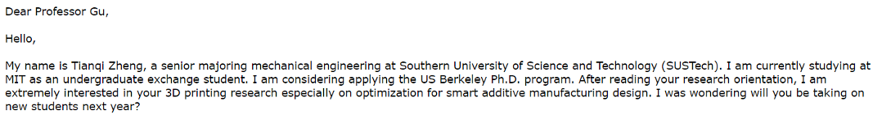
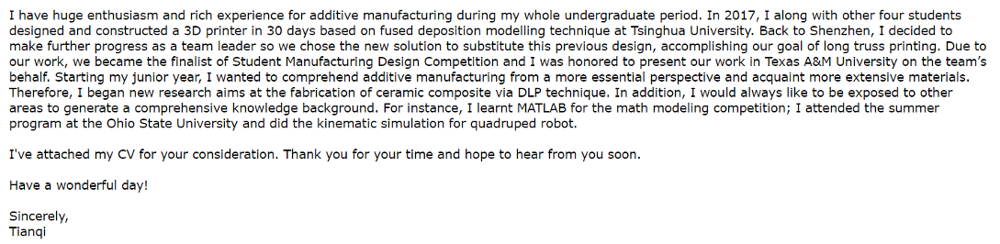
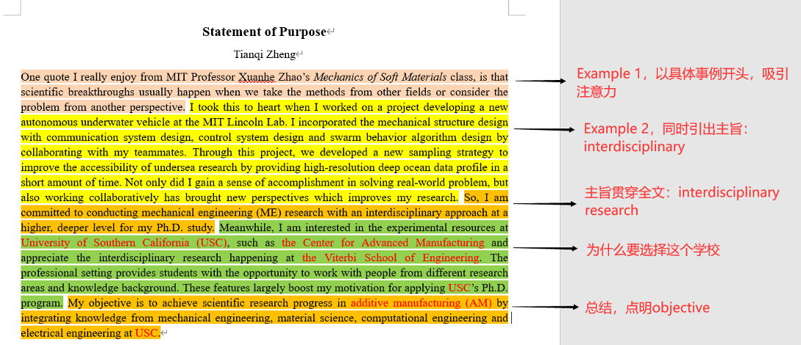
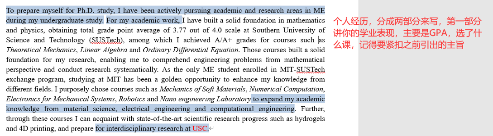
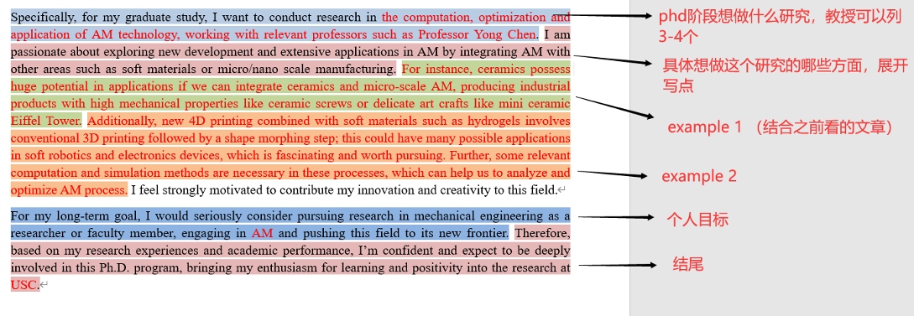
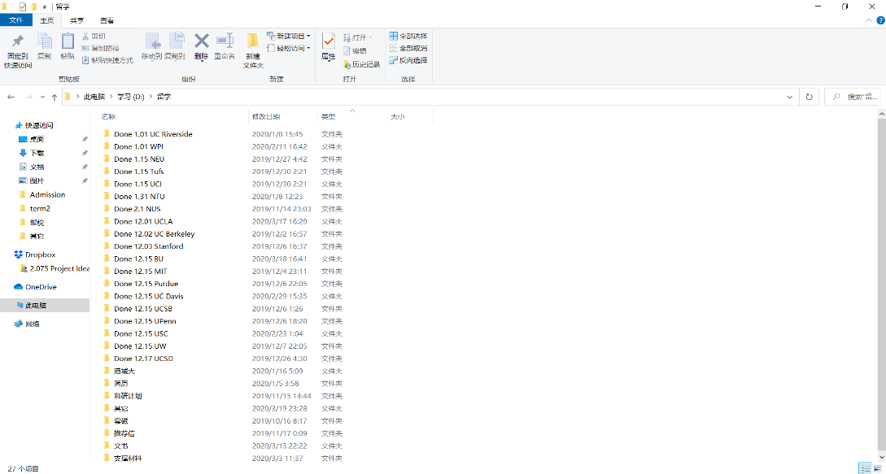

# [US]-16-郑天棋 PhD in  Mechnical Engineering @ UCLA

### 基本信息

> GPA:3.77/4.0 （机械系7/53）
>
> TOEFL：107
>
> GRE:V153+Q168
>
> 清华暑研+推荐信
>
> OSU暑研+推荐信
>
> MIT学年交流+推荐信
>
> 一篇SCI一作(Ceramics International)
>
> 专利2项，2018 Texas A&M University ASME比赛
>
> Email: [tianqizheng@ucla.edu](mailto:tianqizheng@ucla.edu)

 

一共申请了17所美国大学，目前为止获得的结果如下

| 学校         | US News  ranking | Engineering Graduate School ranking | 项目    | 面试情况           | 结果               |
| ------------ | ---------------- | ------------------------------------ | ------- | ------------------ | ------------------ |
| MIT          | 3                | 1                                    | ME PHD  | 无                 | 拒绝               |
| Stanford     | 3                | 2                                    | ME PHD  | 无                 | 拒绝               |
| UC Berkeley  | 22               | 3                                    | ME PHD  | 无                 |                    |
| UCLA         | 20               | 16                                   | ME PHD  | 12.20面(in person) | Offer              |
| UPenn        | 6                | 18                                   | ME PHD  | 无                 |                    |
| USC          | 22               | 10                                   | ISE PHD | 12.18面(in person) | Offer (fellowship) |
| USC          | 22               | 10                                   | ME PHD  | 1.19面（skype）    | 拒绝               |
| UCSD         | 37               | 9                                    | ME PHD  | 无                 |                    |
| UCSB         | 34               | 27                                   | ME PHD  | 无                 | 拒绝               |
| Purdue       | 57               | 7                                    | ME PHD  | 无                 |                    |
| NEU          | 40               | 31                                   | ME PHD  | 无                 |                    |
| Tufts        | 29               | 67                                   | ME PHD  | 无                 |                    |
| UW           | 62               | 24                                   | ME PHD  | 无                 | Admission          |
| UCI          | 36               | 36                                   | ME PHD  | 无                 |                    |
| BU           | 40               | 36                                   | ME PHD  | 无                 | Offer (fellowship) |
| UC Davis     | 39               | 33                                   | ME PHD  | 无                 | Admission          |
| WPI          | 64               | 89                                   | ME PHD  | 1.10面(微信)       | Offer              |
| UC Riverside | 91               | 80                                   | ME PHD  | 无                 |                    |

 

Timetable

| Before 6/2019  | 考出TOFEL,GRE成绩                                     |
| -------------- | ----------------------------------------------------- |
| 6/2019-7/2019  | 选学校，选教授                                        |
| 8/2019-11/2019 | 套磁教授, 给导师联系要推荐信, 准备申请材料：CV+SOP+PS |
| 11/2019-1/2020 | 填写网申信息                                          |
| 12/2019-2/2020 | 面试                                                  |
| 2/2020-4/2020  | 等待结果                                              |

### 前期准备（英语+选学校）

英语：特别特别重要，TOEFL成绩最好高于100，相当于是申请好学校的门票（好多学校在申请网站上写托福只需高于85，90之类的，但其实筛选的时候托福高于100具有很大优势），申请季一般是9月-次年1月（好学校ddl一般是在12.15），所以建议在大三暑假之前把托福和GRE都考出来，多背单词，多做题，建议每天学习英语4-5个小时，TOEFL要高于100，最好高于105。GRE高于320就行，当然越高越好325，330就特别棒。

选学校：一般申请10所学校差不多了，建议在经济允许的基础上（申请一所学校包括投递TOEFL GRE成绩，一共大约170USD=1200RMB），多申请几所学校。然后在申请的学校中要分档次：超过自己实力，特别喜欢的的，申3-5个；和自己水平相符合的，申5-8个；保底的，申3-5个。怎么确定学校：ranking很重要要看一看，然后还要综合各方面因素，专业，导师，校园环境，所在州所在城市，个人喜爱程度。

选教授：如果是phd program，每个学校选1-2个教授，**看看他们的科研方向你是否感兴趣**，课题组官网一般都会有介绍，然后再找2-3篇文章看看，没必要看懂，但要仔细看看abstract，但要比较了解做的哪些实验，解决了哪些问题，之后方便套磁以及面试。

PS：再说一下中介的事，我没有找中介，个人意见如果是phd program没必要找中介，有那钱还不如留着多申几所学校；如果是master program然后感觉时间实在不够用了，找个中介挺省事的，他们会帮你做申请材料SOP+CV。

### 套磁

一般套路是这样的，给教授发邮件，第一段讲我对您哪些研究很感兴趣（记得要提前看看文章），然后请问您明年有招学生的计划吗，或者请问您愿意给我提供面试机会吗（一下是我给其中一个教授写的，我当时看文章没有看的很仔细，对教授研究方向之类的写的不是很多，仅作参考。）

第二段要写一点自我介绍，因为教授一般没有时间打开附件去看你的个人详细资料，所以写一段个人经历介绍，不用太长，然后就表达你的研究经历以及研究兴趣和他很match

 

关于这个套磁信，基本上先写一个模板，然后在研究方向上针对每个教授都改一下，如果有精力，可以多发几个教授，如果时间来不及，选自己最感兴趣的2-3个教授发邮件

 

### 申请材料（SOP+CV+PS）（其中最重要的是SOP和CV）

SOP：statement of purpose，一般要写1.为什么选择phd/master 2.为什么申请这个学校 3.个人经历 4.未来研究兴趣 5.将来想做什么。总体要求：be specific, don’t be general, don’t be vague.

 

 

 

 

注1：那个主旨每个人都不同，之后的个人经历以及研究兴趣也要和主旨呼应吻合。

注2：SOP一般800-1200词就可以，不要超过1500，太长了。

CV：Curriculum Vitae也很重要，一般来说，CV包括“education”“research experience/experience”“patents & publications”“awards & scholarships”“others”，其中，你的TOEFL，GRE，社团，学生会，个人爱好等都放到other里。（如果想参考我的CV可以给我发邮件）

注：CV一般1-2 pages

PS：Personal Statement没那么重要，部分大学（比如UCLA，UC Berkeley）会要求。PS里写一些在SOP没有涉及到关于你的内容。可以是你的高中或者大学个人奋斗经历，你参加或组织的学生会以及社团活动。你性格中的特点，好的特点会有助于你完成你的phd学业，以及你的个人抱负等等。（比较受欢迎的套路是出生在一个普通家庭，一个普通城市/欠发达城市，然后学成归来后利用你的知识建设家乡）。500词左右

### 推荐信

一般3封，有的学校允许你最多提交6封。推荐信也非常重要，如果你在国外做过summer research可以请那个教授帮你写一封推荐信。但是这中间一个很重要的因素是教授对于你的了解程度比教授本身的名气更重要。我当时在MIT交流一年的时候曾经问MIT机械系主任Prof. Gang Chen这个问题，他说即使教授名气再大，如果对你不那么了解，在推荐信上只写一两句话也是没有用的。所以一般来说，要请你的专业导师帮你写一封推荐信，因为他对你比较了解，然后如果你的系主任对你比较了解，也是可以请他帮你写一封。然后如果你在某些课表现比较好，拿了A或者A+，也可以请任课教授帮你写一封。

PS：在申请系统，提交推荐信的时候，有一项它会问你是否要放弃查看推荐信的权利（录取之后），一定要放弃。如果不放弃校方会怀疑推荐信是学生自己写的。

### 面试

这一步也是很重要的，通常通过面试你可以最后拿到非常好的，高于你实力的美国大学。一般来说，面试这一步是和之前套磁那一步联系在一起的，在当时你套磁的若干教授中，如果他们有回信表示愿意面试你，就是非常好的开端！（因为经常你发给教授套磁信教授不会理你的，我当时大约写了7封套磁信，只有两个教授回信）面试前，对教授的研究要有所了解，读大概2-3篇最近两年发表的文章差不多就够，因为到时候面试的重点还是在你身上。面试全程英语，教授会问一些关于你的项目，你的科研，你的专业课程知识，所以一定要很熟悉你的专业知识，你的科研细节，比如说你的这个机器怎么搭建起来的，这个项目有什么难点创新点，会问的很细节。然后还会问你一点research proposal以后想从事什么课题研究，也要基于教授的科研方向（基于你读的那几篇文章和你对这个领域的理解）准备一下。最后还会问你的人生目标，一般如果申请PHD的话标准答案是faculty。申请master你说faculty和industry都行。

PS：有条件去美国交流学习或者summer research的同学一定要抓住这个时期联系教授，当面和教授谈效果要比网络面试好很多，然后不要局限于你呆的这个城市，整个美国都套磁，如果教授答应见你一定要去，别在乎那几张机票钱。

### 写在后面

我的导师白老师曾经说的一番话让我印象深刻：“有的时候机遇和平台要比个人努力更重要。”这也是我为什么对南科大非常感谢，也很幸运高考后选择了南科大来完成自己的本科学业（时常在想如果当时高考高了20分去了同济或者北航，大学生活肯定没有这么精彩）。南科大本身处于深圳市，是一个很好的平台并且充满机会来做项目，做科研，参加比赛，出国交流。其中让我印象最为深刻的就是大四来美国MIT进行一年的学习，真的学到了很多，也对我申请美国学校帮助很大。这也是为什么要去美国读书，我本人的观点是美国科研水平很高，平台很好，可以获得很多联系和机会，而且出国读书也可以帮助增长视野啥的。因此，怀着对南科大的感谢，希望我申请学校中获得的知识经验可以对南科大的同学们有所帮助。

  
