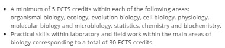
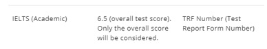
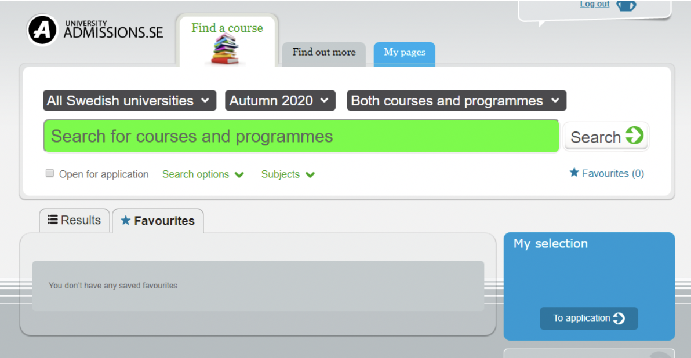
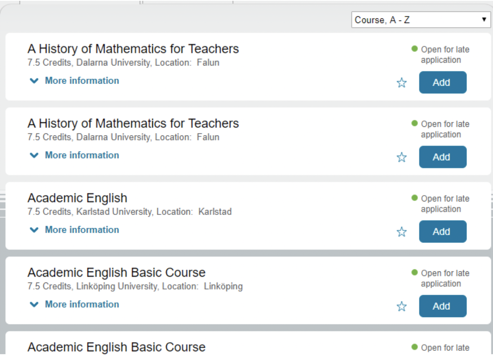
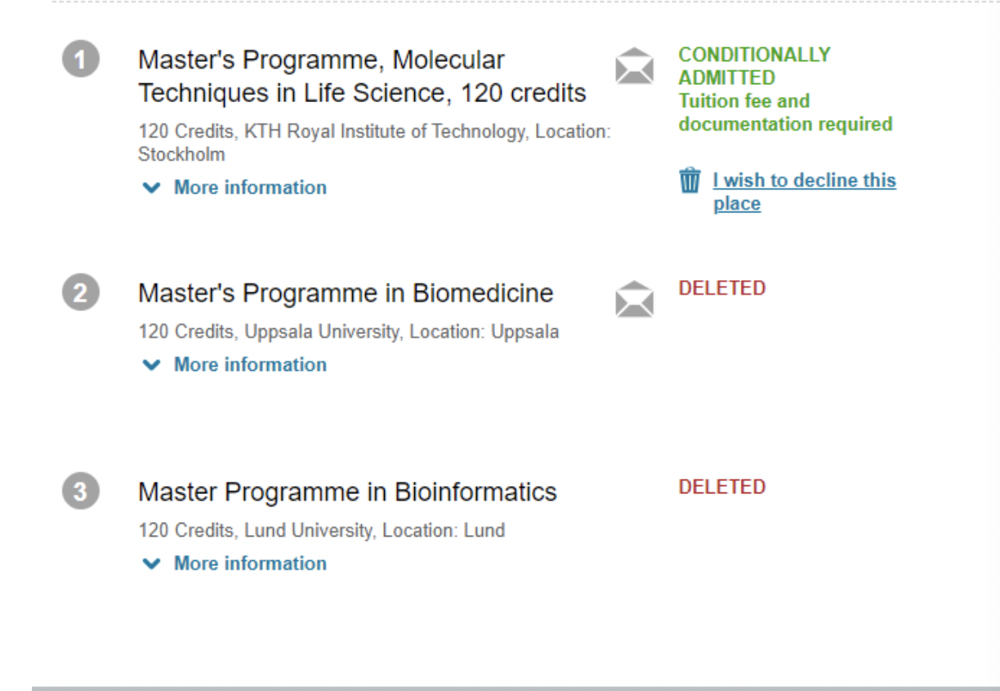

# [SE]-16-孟刘震 MS @ Karolinska Institute

**前言**：学弟学妹们好，我是16级生物医学科学专业的孟刘震，也是医学院的第一届毕业生，从进入南科大开始，虽说未必是自己一开始的打算并不一样，但是阴差阳错还是见证了南科大的历史发展特别是医学院，我见证了从无到有的过程。在这四年的学生生活过程中有开心的记忆也有许多雷点，所以借着这次机会我想给后来的学弟学妹们留下点什么，就算是只帮助了一个人少走一些弯路也是值得的，废话不多说，就让我稍微聊一聊这个“飞跃过程”吧。

### 基本信息

> 专业：生物医学科学
>
> GPA: 2.7
>
> 联系方式（微信）：1262859352

### 申请情况

> Offer：瑞典卡罗琳斯卡医学院和瑞典皇家理工的合作硕士项目

### 专业评价
作为生物医学科学的第一届学生，我对这个专业还是有感情的，因为人数不多，所以同学们关系相当融洽而且医学院的老师们水平也很高，对专业的学习和升学都提供了很多的帮助。但是，我还是需要说一句，如果是没有选择专业的同学而且想来医学院的同学，那么我希望你们能够好好思考一下你们究竟想要什么。以下就是我对你们的**第一个建议**。医学院目前只有**临床医学**和**生物医学科学**两个专业，但是这两个专业未来的方向却完全不一样。

#### 1.临床医学
如果你们选择了临床，首先先不说临床未来的辛苦，因为我认为选择临床的同学应该都做好了心理准备。如果你选择了临床，那么就意味着你在上学阶段出国留学的想法基本等于奢望（并不是不可能，只是很难），如果你意志坚定，家庭条件优异，而且成绩好且愿意付出更多的时间，那么临床专业出国留学未必不可能，只是花的时间可能会比较久，你们更大的可能是国内读研或者读博。所以对于普通的临床医学学弟学妹们，我的建议就是，好好想想临床医学的研究生或者博士要去哪个大学，提前做准备（考研，保研等），因为不知道未来医学院的临床硕士点什么时候落地。本科就业的想法最好不要有，选了这一行，那么本科就业就基本与我们没有缘分了，因为高概率找不到工作（不排除例外）。

#### 2. 生物医学科学
选择生物医学科学专业走的路就是另一条了，你基本宣告与临床无缘了，根据中国学科的分类，我们属于理学，你想回临床（医学）那就是跨学科，这种难度我想大家心里都有数。因此选择本专业的同学我希望你们谨慎考虑，这个专业你未来高概率是走理学行业。所以如果是想学医的同学，我建议你们去临床。而我们这个专业的好处就是出国留学了，医学院的交流资源丰富，竞争也少，具体我会在下一个部分介绍。

### 出国攻略
> 以下建议仅针对北欧，而且主要是面向生物医学科学的同学，其他专业的同学可以当作参考。申请北欧的院校（卡尔玛联盟国家：瑞典，丹麦等）需要注意一下部分：

#### 1. 升学
北欧大部分的项目都要求master学位，因此想直博比较难，但是不是没有需要自己寻找，所以升学北欧意味着必须先读master。而且由于北欧的财政问题，所以奖学金的竞争会比较激烈而且未必会有很好的待遇，比如瑞典KTH的部分奖学金只是补生活费，并不会免学费。好消息是北欧的留学费用相对来说没有那么高，大概两年的学费在20W-30W之间，不同项目不一样，所以请仔细斟酌。

#### 2. 专业匹配度
北欧的院校非常看中专业匹配度，如果没有达到，不管你多优秀都是可能会拒绝你的。什么是专业匹配度如下图：

学校会要求某些类型的课程最低限度的学分要求，你是否达到这个要求就是专业匹配度是否合格，不过不用太担心，**专业匹配度只有合格和不合格**（这只是个requirement），所以一般不会有学的相关课程越多优势越大，只要过了要求那么大家就都一样。（ECTS是欧洲学分，和国内的学分换算大约是**1国内学分=1.5ECTS，也有说是1.25**），所以生物医学科学的同学们需要认真看看自己的课程是否满足专业匹配要求（因为我们能够申请的大部分是生物类项目，所以需要生物相关课程），**这一点请格外注意**。

#### 3. 语言成绩
北欧的母语全都不是英语，但是他们的英语普及率却相当高，所以他们所有的项目要求的语言成绩也是英语，而且要求比英语国家要低。他们的语言要求通常可以分为三类，以雅思为例：A类：7/6, B类：6/5.5， C类就更低了，但是你也就不要想申请了，总分连5.5都没有那是不可能申请到学校的。对于生物医学科学专业的同学，大部分的项目只要求B类，不过也有例外，所以请在官网的项目要求中确认。还有就是北欧的语言成绩也只有合格和不合格两种（同样是requirement），所以如果人家要求6分，你考了7分，那么你和那些考了6分的同学在同一个项目里是没有区别的，人家不会因为你的语言成绩更高就更看重你。这是哥本哈根的语言要求：

#### 4. 文书准备

推荐信北欧通常是要求1-2封，数量够就行，对于北欧申请作用有限，但是这只是指国内推荐信，如果是你申请的国家的院校的推荐信，那就有点用，他们对自己体系的信任程度比较高，所以如果你打定注意去北欧，可以尝试去北欧交流，拿一封推荐信。但是没有也没关系，因为推荐信的作用始终有限。必须有的一般是motivation letter和personal statement，这两个可以寻求我们学校语言中心的帮助，可以无偿的帮你修改文书，当然也可以找中介，但是北欧申请其实可以不用中介因为流程并不复杂。同样想练雅思也可以找语言中心，我们语言中心的老师有一些以前是雅思的考官，所以请把握机会，现在雅思一次考试很贵。

#### 5. 个人硬件
刚刚说了很多，但是我都说是requirement，只要过了就可以，那么可能有人问了，那人家高校看什么？看硬件，什么硬件？就是你的个人能力，比如GPA，比如科研能力（社会实践能力用处有限，有那功夫不如去实习）。所以请各位生物医学科学的同学记住，保持一个好GPA很重要，然后就是因为咱们的比赛少，所以拿奖的机会不多，请把握大创项目和攀登计划等科研项目，那就算你的科研经历啊。当然能参加一些比赛拿到成绩也是很好的。以上这些都没有，那么有相关领域实习经历也是可以的（虽然个人不推荐，因为也挺费时间）

#### 6. 特殊攻略
这个攻略是具体攻略，具体到什么，具体到瑞典，瑞典是我接触到的几个申请最方便的国家之一。瑞典是不分授课型硕士和研究型硕士的，而且他的申请是网上申请，网址是：[www.universityadmissions.se](http://www.universityadmissions.se)。不需要翻墙。

可以自由搜索所有可以申请的项目，推荐先在学校官网看好，然后直接来选择。通常来说系统会在10月开放，然后大部分好的项目会在1月15日关闭申请，所以请提前做好准备。每个人最多可以同时填写四个项目，但是有个注意事项，那就是这很像是咱们高考填志愿，四个项目说是平行志愿但是是有先后的，放在第一的项目录取之后，其他项目就没有录取的机会了，所以请将最想去的放在第一个（当然也要去的了，别像高考500分，第一志愿填清华），第一志愿录取后，其他志愿会被自动删除，如下图。

通常来说，申请截止后，你的志愿状态会有三种状态，In progress；Qualified；Unqualified。通常来说4月份左右放榜，所以在3月中旬之前你的申请应该大部分是In progress。比如2020年是4月3日放榜，那么我是在3月23之前都是In progress。但是如果有一天不是In progress，那么同学们就要关注一下了，如果是qualified，那么恭喜你，你的材料审核完成没有任何问题，一般来说此时你有50%的概率被录取，具体结果要放榜日才能知道，但是算是半只脚踏进去了，但是如果是Unqualified，那就要注意了，你问题可能就有点大，这意味着你的材料审核不合格，要及时联系学校确认什么东西不合格，一般这距离放榜还有几个星期，所以请尽力抢救（虽然成功的可能性不大，因为很多学校会因此把你重新提交材料当做late application，所以请尽量保证最开始体交的时候材料就没问题），记得向学校确认的时候附上自己的申请码`Application number`，这在自己的申请界面就有。

到了放榜日的那天，所有的录取生都会从Qualified的学生中产生，所以一旦你是Qualified了，那就意味着未来你只有两种结果：Conditionally admitted或者Reserved。Reserved是什么意思？就是说学校录取30个人，现在由50个人进入了Qualified，这50人每个人是有一个分数的（学校打的，你看不到，只有学校知道）。按照分数排名，前30人就直接Admitted，后20人就是Reserved，意思是如果前30人有人不去，也就是拒绝了Admitted（比如同时申请多个国家，别的录了，不去瑞典了），那么这些Reserved的就会按顺序往前补。但是如果你不在Reserved的前几个人中，这就涉及到之前说的平行志愿问题，如果第一志愿没有直接录取你，第二志愿录取了你，你可以选择接受第二志愿的录取，也可以选择继续呆在第一志愿的Reserved里。个人选择，祝你好运，我建议就别等了，选择下一个志愿吧。（有些学校第二志愿是不允许申请奖学金的，所以在第一第二志愿填写时请谨慎）

以上就是我对专业选择，和升学申请的全部攻略和建议，虽然还有很多攻略想写，但是篇幅太长，所以就此打住，希望各位学弟学妹们能够顺利完成自己的理想，自然选择，前进四。