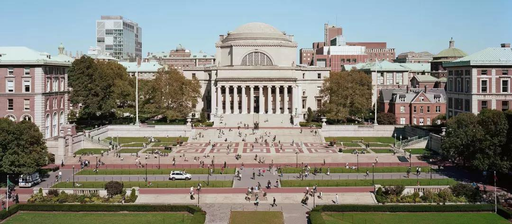
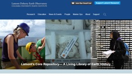
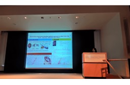
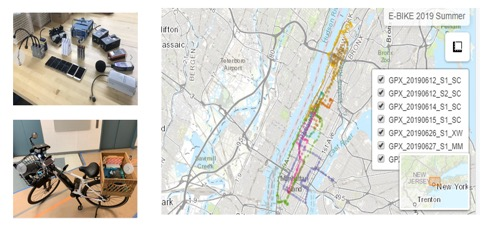
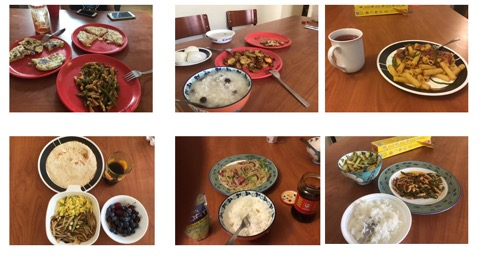

# 哥伦比亚大学LDEO暑期科研

> by 武鑫 11612722 树仁书院 环境科学与工程学院

## 一、哥伦比亚大学暑期科研项目内容介绍

美国哥伦比亚大学，是一所位于美国纽约曼哈顿的世界顶级私立研究型大学，为美国大学协会（AAU）的十四所创始院校之一，常春藤盟校之一。哥伦比亚大学在2019年的USNews美国大学综合排名第3名，世界大学排名第8名。

该实习项目由哥伦比亚大学地球科学研究所、拉蒙特-多尔蒂地球观测站（Lamont-Doherty Earth Observatory）、巴纳德学院（Barnard College）和地球与环境科学系共同资助，面向哥伦比亚大学本校学生，社区大学，和南方科技大学环境、海洋、地球与空间科学等相关专业的大二、大三本科生开放申请。具体申请信息可关注南科大环境公众号或者去官网查询：[www.ldeo.columbia.edu](http://www.ldeo.columbia.edu)

项目时间： 十周（5月28日到8月3日）

 |

## 二、哥伦比亚大学暑期科研申请攻略

1. 面向学生：

大二、大三年级本科生；

对地球科学、大气科学或者海洋科学研究感兴趣；

建议修读至少两门地球科学、大气科学或者海洋科学课程；生物、化学、等其他专业学生可通过官网查询查找自己感兴趣的项目和老师进行申请：www.ldeo.columbia.edu/education/programs/summer-internship/lamont-summer-intern-program

已修读过至少一年的微积分课程

2. 申请方式

每年申请截止时间不同，可关注南科大环境公众号根据提供的网页链接线上填写表格。

3. 申请材料

成绩单电子版；

Resume:简历主要介绍自己的选修课程，主要科研经历，编程技能；

Statement of interest：根据哥大发的项目介绍选择三项自己感兴趣的，并确定一二三志愿，描述成为一个优秀科学家的必备素质；

两封教授的推荐信；

4. 衣食住行

由哥伦比亚大学统一安排在学校宿舍，我们住在Columbia Main Campus Certhedral Garden，一般为五人到六人合住（三到四个个单人间一个双人间），十楼备有洗衣房和公共休闲区，住宿费用由南方科技大学预先缴费。

交通方面，从宿舍到Lamont研究所大概花费一小时或者四十分钟，本项目负责老师Dallas会给Intern安排早上八点半在Broadway 116st的免费小巴士（特别像幼儿园接送校车），下午四点半再从Lamont返回；从Main Campus到Lamont每小时也会一趟往返shuttle。NYC的地铁坐一次2.75美元（可以选择refill time和refill value，如果经常出去玩建议refill time一个月花费150美元），如果地铁转乘公交的话两个小时内不收费。

饮食方面，在Lamont研究所的Cafeteria吃一般为各种特色沙拉，汉堡，香菇汤或者杂烩鸡汤，一餐大概八到十美元；自己做饭的话很划算，哥大会给每间公寓提供足够多的餐具，住宿附近会有Foodtown和Market提供蔬菜主食材料，做中餐的话附近110街会有Hmart一家韩国超市其中有丰富的中国食材，大概每周花费三十到四十美元。

美国六月期月份是多雨季节，温差大，建议多带外套，长衣长裤。

5. 资助情况

除住宿费外，南方科技大学还将提供一定金额的生活费补助，1.5万元。需要在六月份前申请留学交流资助，做好留校及交流备案机票和生活费得。

主要花费：办理美国J1交流签证，还有Intern交流费用（总共340美元）；往返机票提前一个月预订（花费4000元左右；饮食交通十周花费1000美元左右。

6. 注意事项

申请J1签证除了填写DS-160表格，还需要哥大方提供DS-2019表格，该表格需要填写自己研究项目和学习计划，后由Lamont国际合作部和导师签字邮寄到学校。时间安排比较紧张建议尽早填写。

同学在拿到offer后要申请延期期末考试，所以想去的同学最好大二把必修课尽量选上，这样大三下学期的课业不会那么重。

## 三、科研经历分享

  本次去哥伦比亚大学Lamont研究所进行了为期十周的大气污染与人体健康方面的研究，受益匪浅。整个暑期项目一共有33个实习生，分别来自哥大Barnard college,纽约社区大学和南科大环境系。十周的科研安排很紧凑，我们在第一周参观Lamont不同地质、海洋，生态不同领域研究楼，进行实验安全培训，分别与自己的mentor见面确定具体研究方向、每周开会时间等细节；在第一个月（第四周）左右完成自己课题的proposal，具体包括specific research question, methods 两项内容，会在Dallas(该项目带队研究科学家）的安排下三人一组开展口头报告（讨论比较轻松，主要是分享自己的课题内容）；在第二个月会重新分组完整的讲述自己研究内容（research question，methods, result); 最后一周比较关键也是最繁忙的一周，最后一天早上需要在Monell auditorium 完成 1-min- slide 的报告（一般是30-45秒，33个实习生连续不间断的简短介绍自己的研究，语速快到飞起），下午在Comer building 一楼站在各自的Poster展示区向大家介绍自己的这十周的研究成果。另外Dallas每周都安排了Lamont研究所里的科学家向大家分享自己的研究（例如Geomap、Climate change、responsible Science)。

 |

  我的研究课题是在骑行过程中评估纽约曼哈顿区超微粒子污染程度，出野外就是背着二十多个测空气质量的设备骑着半电动自行车在曼哈顿区环形。我影响最深刻的一次骑行是从Hudson river 出发，到达Washington square Park后再经过一条Business Street沿着Central Park 中间的畅通无阻的骑行道返回Main Campus, 历时两小时四十分钟，总长 15.6英里。

## 四、生活娱乐

  这两个多月我提升最高的不仅仅是英语，还有厨艺。因为很不习惯美国的饮食，Lamont 又提供了很完备的厨具，我们同行的三个人基本上每天都是在公寓自己做饭，每周都会去Food town 大采购水果蔬菜或者去H-mart一家韩国超市买一些华人主食。后来因为个人口味不同我们分开在各自的公寓做饭，我的厨艺真的是大大提升，同时也会经常和我的一位来自厄瓜多尔舍友分享食物。这位舍友在五年前来纽约之前并不通晓英语，现在在新泽西一所社区大学读大三，最震撼的是儿子已经17岁了马上跟她一样步入大学。她的经历让我觉得人生充满无限可能，只要保持一颗年轻的心不断奋进！

 

  